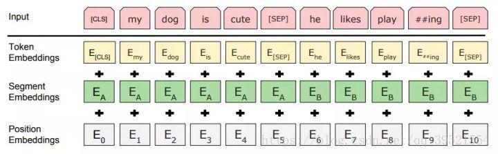
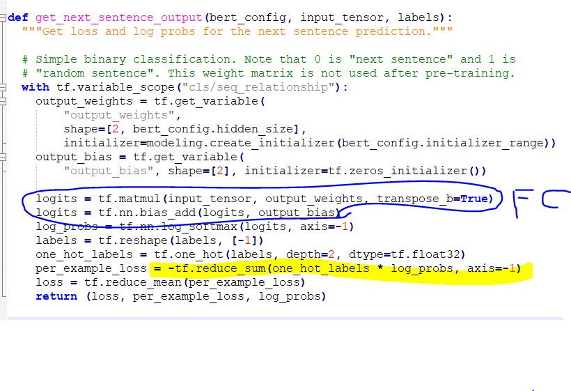
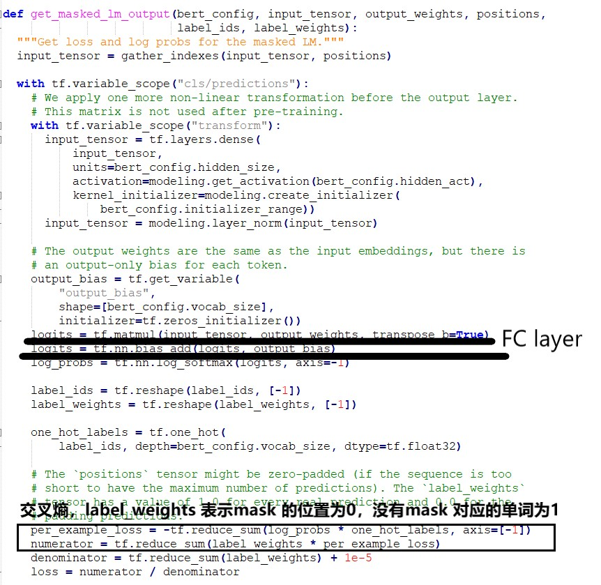

### （一）目的

​	用无监督的方法（无标记的训练数据）来训练**动态的词向量**（词向量可以不固定，在不同的上下文中相同单词对应的词向量可以不同，因此该词向量来源于一个模型，模型的输出就是我们需要用于后续任务的词向量）。 

​	我们需要训练一个模型，这个模型能够使得输出的每个位置的词向量具有**联系上下文的能力**，并且具有**丰富的含义**。

### (二) 模型的输入输出和损失函数

输入两个句子。将每个句子对应的 token embedding , segment embedding 和 position embedding 进行相加。

- **输入**： token embedding + segment embedding + position embedding

  - **token embedding**

    对每个单词进行**随机初始化**向量输入， 输入序列的开头加上【CLS】。如果输入是两个句子，可以在句子之间添加 【SEP】标记。正常情况下是输入一个序列，不需要加 【SEP】， 但是在训练的时候，针对QA等问题需要理解两个句子之间的关系的问题。因此在预训练中增加了一个对下一个句子的预测的任务（第三部分有讲到）。

  - **segment embedding**

    第 i 个句子的 one-hot 向量表示。如果只有一个句子那就全是0了，如果有两个句子就是一个0，一个1, embedding 的维度要和 token embedding 的维度一样。

  - **position embedding**

    随机初始化的位置向量，让模型自己去学，对于每个位置其位置向量是怎么样的。
  
  

- **输出**
  - 输出长度和输入长度相同，词向量的维度可以自己定义。 
  - 【CLS】 输出位置对应的向量用于表示包含有整个序列的语义表达。 所以在做分类或者第二个训练任务的时候用到的是这部分的输出。

- 损失函数

  - 交叉熵损失函数。

  - 将相应位置的输出，先需要进过一个全连接层将其维度和对应词向量的 one-hot 表示维度一致，然后计算交叉熵。

    

    

### （三）预训练的任务

- **Masked LM**

  为了使得模型训练得到的输出具有理解上下文的含义，作者提出了采用 masked LM（MLM） 。 这里的 MLM 就是将随机的将句子中的一些词隐藏掉，然后根据文本的上下文对这写隐藏掉的词进行预测（可以理解为做**完形填空**）。 

  但是如果每次在训练的时候每次都对某个单词做了 mask 那么在测试的时候可能会出现这个单词不存在的现象。因此这里的mask 采用了下面的方法：  

  - 80%的时间真的用[MASK]取代被选中的词

    my dog is hairy -> my dog is [MASK]

  - 10%的时间用一个随机词取代

    my dog is hairy -> my dog is apple， 防止模型将 【mask】就记作hairy了，迫使模型去考虑上下文。

  - 10%的时间保持不变

    my dog is hairy -> my dog is hairy, 防止 fine-tuning 的时候模型会有一些没见过的词。

  

- **下一句预测**

  很多NLP的任务比如QA和NLI都需要理解两个句子之间的关系，而语言模型并不能直接反应这种关系。为了是预训练出来的模型很好的适应这些任务。 就是将 【cls】 位置对应的输出用来做分类。 如果输入的两个句子是连续的上下文词那么分类标签为1，如果不是就是0。

### (四) 网络结构

​	基本版： 12-layer, 768-hidden, 12-heads, 110M parameters。

​	扩大版：24-layer, 1024-hidden, 16-heads, 340M parameters。

​	

### （五）[已训练好的模型和代码](<https://github.com/google-research/bert>)

- uncased(不区分大小写)
- cased(区分大小写)
- multilanguage (多语言)
- chinese(中文)

​	