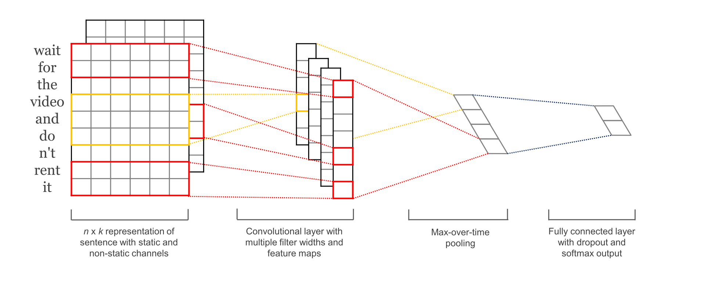

## [Convolutional Neural Networks for Sentence Classification](https://arxiv.org/pdf/1408.5882.pdf)

### 输入(Embedding Layer)

- rand

  随机初始化词向量。

- static 

  采用 word2vec 词向量进行初始化，并且在模型训练的时候词向量不能够进行微调。

- non-static 

  即拿word2vec训练好的词向量初始化, 训练过程中再对它们微调。

- multichannel

  每个单词生成多个词向量， 这里的词向量的数量体现通道的数量上。

### 输出（Output Layer）

- FC layer + Softmax 
- Cross Entropy Loss

### 主体结构

- 卷积层

  - 采用了高度为 【3，4， 5】宽度等于词向量维度的卷积核。 

  - 对每个高度的卷积核其卷积核数量是100。

  - 没有padding

  - 计算（batch 假设为1 ）：

    假设输入的文本长度为 80， 词向量的维度是 300。 经过这一步我们可以得到 【1， 78，1，100 】，【1， 77，1, 100 】, [1, 76, 1, 100] 这三个tensor。 这里的四个维度分别表示  【batch size, height, width, channels】。

- 池化层

  **这里的 max pooling 从相同大小的 滤波器得到的 tensor 中选取出最重要的特征（不同位置最重要的特征）**。

  - 采用的是 max pooling

  - 大小是 [1,78, 1, 1], [1, 77,1,1], [1,76,1,1]

  - 计算

    经过这样的操做，可以得到的tensor 分别是 [1, 1, 1, 100], [1, 1, 1, 100], [1, 1, 1, 100]。要把这三个给 输出层需要进行  concatenation 然后reshape就好了。

